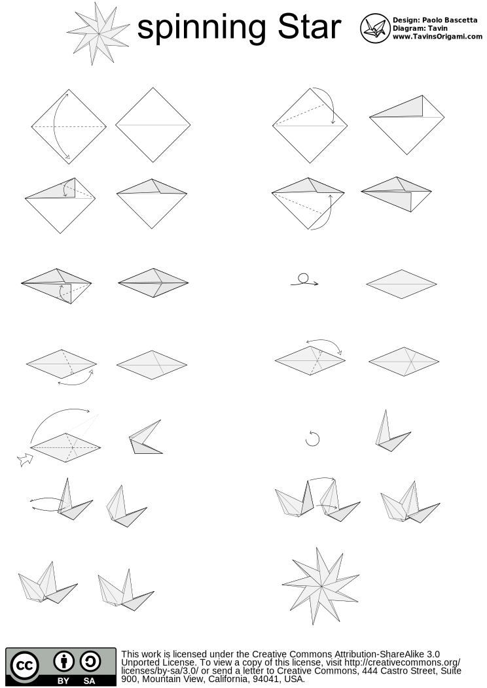
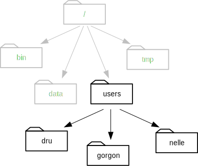
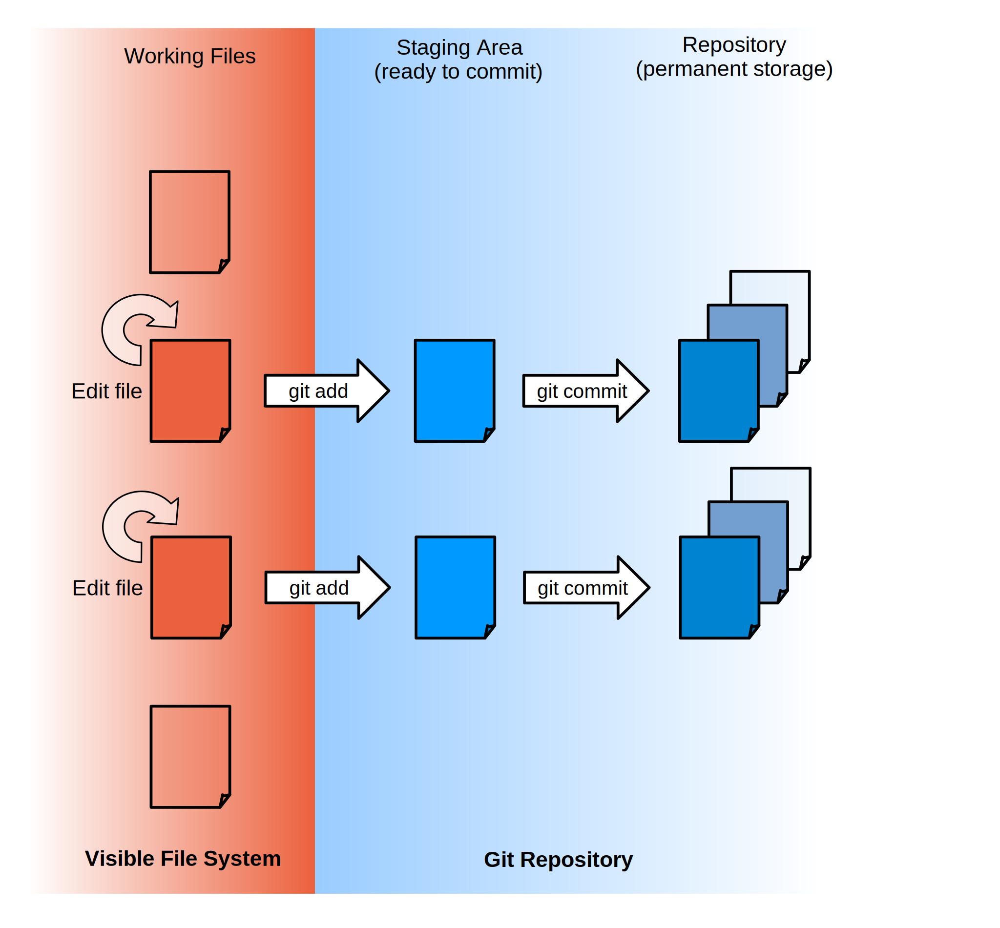
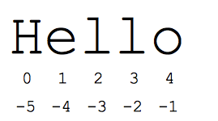
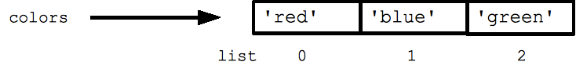
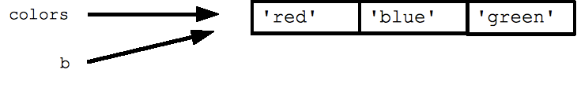
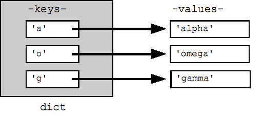

.. -*- coding: utf-8 -*-

...  Copyright 2015 Six Feet Up, Inc.

     Licensed under the Apache License, Version 2.0 (the "License");
     you may not use this file except in compliance with the License.
     You may obtain a copy of the License at

         http://www.apache.org/licenses/LICENSE-2.0

     Unless required by applicable law or agreed to in writing, software
     distributed under the License is distributed on an "AS IS" BASIS,
     WITHOUT WARRANTIES OR CONDITIONS OF ANY KIND, either express or implied.
     See the License for the specific language governing permissions and
     limitations under the License.

:title: Intro to Programming
:event: Eleven Fifty
:author: Calvin Hendryx-Parker
:pygments: tango
:css: custom.css

.. |space| unicode:: 0xA0 .. non-breaking space
.. |br| raw:: html

     

----

Intro to Programming using Python
=================================

----

Your Instructor
===============

Calvin Hendryx-Parker, CTO
++++++++++++++++++++++++++

Six Feet Up, Inc.
-----------------

Eleven Fifty Instructor

.. note::

    Introduce yourself, why are you the person they should be listening to for
    the next 5 days.

    Started programming in 1998 (PHP, Visual Basic and ASP)

    Started using Python in 1999 (with Zope)

----

Quick Survey
============

.. note::

    Why did you sign up for this course?

    Who has written a program before?

    Who knows what the console or terminal is on your computer?

    Would you rate yourself an expert at Excel?

    Who has done an intro programming course before?

----

Goals
=====

* Learn basic terminology used by programmers
* Build useful software you can use now

.. note::

    End project will be to build tools to manipulate CSV data you might use in Excel

    Python is the most popular teching language at the university level right now

    Python creator Guido von Rossum believes Python caught on in the labs because "scientists often need to improvise when trying to interpret results, so they are drawn to dynamic languages which allow them to work very quickly and see results almost immediately."

----

Quick Chat
==========

IRC
+++

http://webchat.freenode.net?channels=#ElevenFifty

irc://chat.freenode.net/ElevenFifty

.. note::

    Internet Relay Chat can be used to overthrow govermnents

    but more importantly, it is a space where many projects developers gather and answer questions

----

Let's get setup for the course
==============================

* Install Python
* Install PyCharm

Optionally:
+++++++++++

* Install VirutalBox
* Import our Virtual Appliance

----

Python Install
==============

* Mac OS X includes Python 2

  * Install Python three from `Home Brew`_
  * OS XCode Command Line tools

* Ubuntu Linux includes Python
* Python Installers @ python.org_

.. _Home Brew: http://brew.sh
.. _python.org: http://www.python.org

.. note::

    xcode-select --install to install the tools on mac

----

Git Install
===========

* Included on OS X
* Install from package repos on Linux
* http://git-scm.com/downloads for other installers

.. note::

    We will be using git during the course

----

PyCharm Install
===============

* Installers for Mac and Windows
* Requires Java

.. code:: sh

    $ $EXTRACTION_PATH/pycharm-edu-1.0.1/bin/pycharm.sh

.. note::

   ubuntu ppa for java http://www.webupd8.org/2012/09/install-oracle-java-8-in-ubuntu-via-ppa.html

----

What are Computer Programs
==========================

* Collection of instructions

  * Interact with the user
  * Interact with the computer hardware
  * Process data

.. note::
    We all know what a computer is?  it is a machine that stores pieves of information
    It also moves, arranges and controls that information (or data)

----

Computers are not very smart
============================

.. note::
    They can only do what you tell them to do

----

They follow sets of Instructions
================================

::

    Strawberry Kiwi Tart

    Ingredients:

    Crust:
    1 box Pillsbury™ refrigerated pie crusts, softened as directed on box

    Filling:
    2/3 cup Yoplait® 99% Fat Free creamy vanilla yogurt (from 2-lb container)
    1 container (8 oz) reduced-fat sour cream
    1 box (4-serving size) vanilla instant pudding and pie filling mix
    2 tablespoons orange marmalade

    Topping:
    1 cup halved fresh strawberries
    2 kiwifruit, peeled, thinly sliced
    2 tablespoons orange marmalade

    Directions:

    Step 1: Heat oven to 450°F. Make pie crust as directed on box for One-Crust Baked Shell, using 9-inch tart pan with removable bottom or 9-inch glass pie plate. Bake 9 to 11 minutes or until light golden brown. Cool completely, about 30 minutes.

    Step 2: In medium bowl, mix filling ingredients with wire whisk until well blended. Pour into cooled baked shell. Arrange strawberries and kiwifruit on filling.

    Step 3: In small microwavable bowl, microwave marmalade uncovered on High 5 to 10 seconds or until melted. Brush over fruit. Refrigerate about 1 hour or until set before serving. Cover and refrigerate any remaining tart.

Source: http://www.foodista.com/blog/2015/02/27/beautiful-strawberry-kiwi-tart

----

Algorithms
==========

.. note::

    Fancy name for instructions we give to computers

    Like a recipes with specific steps to follow

    Usually with a lot more steps and written in a programming language like Python

    Imagine telling someone to make a PB&J and they have no idea what a knife is or how to open the peanut butter

----

Quick Calculator
================

.. code:: python

    >>> 2 + 2
    >>> 12 -3
    >>> 9 + 5 - 15

.. note::

    Open PyCharm and get into the python shell to try it out as a calculator

    In the programming world, we call the + and - operators

----

More Math
=========

.. code:: python

    >>> 6 * 5
    >>> 6 / 2
    >>> 10 * 5 * 3
    >>> 10 / 3

.. note::

    careful with integers and decimals

    Python 3 knows what you "mean", but python 2 would not give you the same answer

    integers vs floats (decimals)

    Ruby for example will tell you 10/3 is 3

    Python 2 is also the same

    If you want decimals, you have to talk in decimals in those languages

----

Comparison Operators
====================

.. list-table::

   * - ``==``
     - Equal to
   * - ``!=``
     - Not equal to
   * - ``<``
     - Less than
   * - ``>``
     - Greater than
   * - ``<=``
     - Less than or equal to
   * - ``>=``
     - Greater than or equal to

.. note::

    we will go over a coule examples and discover another datatype of Python

----

Comparison Practice
===================

.. code:: python

    >>> 5 < 4 + 3
    >>> 12 + 1 >= 12
    >>> 16 * 2 == 32
    >>> 16 != 16
    >>> 5 >= 6

.. note::

    Try these out and see what the interpreter returns to you

----

Editors
=======

Text Editors
++++++++++++

* Vim
* Emacs
* Sublime Text
* Textmate
* Notepad++

IDE
+++

* PyCharm
* Wing IDE
* Komodo
* XCode
* Eclipse

.. note::

    explain IDE

    git init and then add all the course files

----

PyCharm
=======

Hello World
+++++++++++

----

Intro to Shell
==============

At a high level, computers do four things:

- run programs
- store data
- communicate with each other
- interact with us

.. note::

    most of us use windows, icons, mice, and pointers

    These technologies didn't become widespread until the 1980s

    Going back past the 1950s, the only way to interact with early computers was to rewire them.

    But in between, from the 1950s to the 1980s, most people used line printers.

    These devices only allowed input and output of the letters, numbers, and punctuation found on a standard keyboard,

    so programming languages and interfaces had to be designed around that constraint.

----

Command-line interface
======================

CLI vs GUI
++++++++++

.. note::

    The heart of a CLI is a **read-evaluate-print loop**, or REPL:

    when the user types a command and then presses the enter (or return) key,

    the computer reads it, executes it, and prints its output.

----

REPL
====

* **R** ead
* **E** xecute
* **P** rint
* **L** oop

.. note::

    This description makes it sound as though the user sends commands directly to the computer,

    and the computer sends output directly to the user.

    In fact, there is usually a program in between called a **command shell**.

----

Popular Shells
==============

* bash
* zsh
* csh

.. note::

    Windows has a shell as well `cmd.exe`

----

Windows Shell Alternatives
==========================

* Window's PowerShell
* Cygwin

.. note::

    We will not cover these!

----

Let's get started
=================

.. code:: sh

    $ # I'm a prompt

.. note::

   The dollar sign is a prompt, which shows us that the shell is waiting for input; your shell may show something more elaborate.

----

Run some commands
=================

.. code:: sh

    $ whoami
    calvin

.. code:: sh

    $ pwd
    /home/calvin

.. note::

    finds a program called whoami,

    runs that program,

    displays that program's output, then

    displays a new prompt to tell us that it's ready for more commands.

    whoami and why not whereami?

    in the early 1970s, when Unix was first being developed, every keystroke counted: the devices of the day were slow, and backspacing on a teletype was so painful that cutting the number of keystrokes in order to cut the number of typing mistakes was actually a win for usability

----

The Filesystem
==============

.. image:: figures/filesystem.svg

.. note::

    To understand what a "home directory" is, let's have a look at how the file system as a whole is organized. At the top is the root directory that holds everything else. We refer to it using a slash character / on its own; this is the leading slash in /users/nelle.

----

Home Directories
================

.. note::

    Underneath /users, we find one directory for each user with an account on this machine

    two meanings for the / character. in front of name it is the directory root, inside a name, it is a seperator.

----

Listing Files
=============

.. code:: sh

    $ ls
    creatures  molecules           pizza.cfg
    data       north-pacific-gyre  solar.pdf
    Desktop    notes.txt           writing

----

Listing Files
=============

.. code:: sh

    $ ls -F
    creatures/  molecules/           pizza.cfg
    data/       north-pacific-gyre/  solar.pdf
    Desktop/    notes.txt            writing/

.. code:: sh

    $ ls -F data
    amino-acids.txt   elements/     morse.txt
    pdb/              planets.txt   sunspot.txt

.. note::

    we use an flag `-F` to change the output

    we use an argument to get different information

    data doesn't have a slash, it is relative to where you are

----

Listing Files
=============

.. code:: sh

    $ ls -F /data
    access.log    backup/    hardware.cfg
    network.cfg

.. note::

    Now we are using an absolute path

----

Changing Directories
====================

.. code:: sh

    $ cd data
    $ pwd
    /home/calvin/data

.. note::

    nothing fancy here, we change into the directory

    try running `pwd`

.. code:: sh

    $ cd ..
    $ pwd
    /home/calvin

.. note::

    ".." is a special directory meaning the one containing this one or its parent
    this special directory doesn't show up unless we use the `-a` flag
    the current directory is "."

    . and .. don't belong to the command ls, every program can use them.

    stop and explain about what using `cd` with no args will do and what the special `~` shortcut are

----

Creating Files and Directories
==============================

.. code:: sh

    $ mkdir thesis

.. code:: sh

    $ cd thesis
    $ touch draft.txt

.. note::

    use ls to verify that your directory has been created

----

Removing Files and Directories
==============================

.. code:: sh

    $ rm draft.txt

.. code:: sh

    $ cd ..
    $ rmdir thesis
    rmdir: failed to remove `thesis`: Directory not empty

.. code:: sh

    $ rm thesis/draft.txt
    $ rmdir thesis

.. code:: sh

    $ rm -r thesis

.. note::

    there is no "trash" here, deleting is forever

----

Moving Files and Directories
============================

.. code:: sh

    $ mv thesis/draft.txt .

.. note::

    Can do the same as a copy as well using `cp`

----

Wildcards
=========

\* is a **wildcard**
++++++++++++++++++++

\? is also a **wildcard**
+++++++++++++++++++++++++

.. note::

    \* matches zero or more charaters

    \? matches one charater

    we can talk more shell later, but lets get to some programming

    pipes and redirecting output are extremely useful as a developer

----

Version Control
===============

* git
* Mercurial (hg)
* Subversion (svn)
* CVS

.. note::

    we will only cover git

    mention github and bitbucket as social coding platforms

----

Why Version Control
===================

.. image:: figures/phd101212s.gif

----

Quick Git Primer
================

.. image:: figures/git-staging-area.svg

----

Quick Git Primer
================

----

Setup git Environment
=====================

* Name
* Email Address

----

Quick git Excercises
====================

* Initialize your PyCharm Introduction
* Stage all of the project files
* Commit the changes
* Do the "Comments" tutorial
* Diff your changes
* Stage and Commit these changes

----

Quick Overview of Computer Languages
====================================

* Low Level
* High Level
* Compiled
* Interpreted
* Strongly Typed
* Dynamically Typed
* Weakly Typed

.. note::

     languages require total and complete detail about everything. C and C++ are such languages

     Other languages will make all sorts of assumptions, and this lets the programmer specify less detail. Python and Basic are such languages, and are called high-level languages

    Java and C are strongly typed

    Python is Strongly typed, but typically it is referred to as dynamically typed

    Javascript, Perl and PHP are weakly typed

----

Zen of Python
=============

Let's get this started with the right mindset

.. code:: python

    >>> import this

.. note::

    These are specific to Python, but let's go over them quickly and we will refer back to them from time to time during the class

----

Variables
=========

In many other languages, assigning to a variable puts a value into a box.

.. list-table::
   :class: incremental borderless

   * - ::

        int a = 1;

     - .. image:: figures/a1box.png
          :class: incremental

Assigning another value to the same variable replaces the contents of the box:

.. list-table::
   :class: incremental borderless

   * - ::

           a = 2;

     - .. image:: figures/a2box.png
          :class: incremental

Assigning one variable to another makes a copy of the value and puts it in the new box:

.. list-table::
   :class: incremental borderless

   * - ::

           int b = a;

     - .. image:: figures/b2box.png
          :class: incremental

     - .. image:: figures/a2box.png
          :class: incremental

.. note::

    Box "a" now contains an integer 1.

    Now box "a" contains an integer 2.

    "b" is a second box, with a copy of integer 2.  Box "a" has a separate copy.

----

Python has "names"
==================

In Python, a "name" or "identifier" is like a parcel tag (or nametag) attached to an object.

.. list-table::
   :class: incremental borderless

   * - ::

           a = 1

     - .. image:: figures/a1tag.png
          :class: incremental

If we reassign to "a", we just move the tag to another object:

.. list-table::
   :class: incremental borderless

   * - ::

           a = 2

     - .. image:: figures/a2tag.png
          :class: incremental

     - .. image:: figures/1.png
          :class: incremental

If we assign one name to another, we're just attaching another
nametag to an existing object:

.. list-table::
   :class: incremental borderless

   * - ::

           b = a

     - .. image:: figures/ab2tag.png
          :class: incremental

.. note::

    Here, an integer 1 object has a tag labelled "a".

    Now the name "a" is attached to an integer 2 object.

    The original integer 1 object no longer has a tag "a".  It may live
    on, but we can't get to it through the name "a".  (When an object
    has no more references or tags, it is removed from memory.)

    The name "b" is just a second tag bound to the same object as "a".

    Although we commonly refer to "variables" even in Python (because
    it's common terminology), we really mean "names" or "identifiers".
    In Python, "variables" are nametags for values, not labelled boxes.

    If you get nothing else out of this tutorial, I hope you understand
    how Python names work.  A good understanding is certain to pay
    dividends, helping you to avoid cases like this:

    We will go over why this is more important later when we get into examples of functions.
    Not understanding how a language handles variables (and scope) can lead to confusing results.
    You "assign" a name to a value and that process is called "assignment"
    Next we talk about data types which are determined when you perform assignment

----

Data Types
==========

Python has many native datatypes. Here are the important ones:

* **Booleans** are either True or False.
* **Numbers** can be integers (1 and 2), floats (1.1 and 1.2), fractions (1/2 and 2/3), or even complex numbers.
* **Strings** are sequences of Unicode characters, e.g. an HTML document.
* **Bytes** and **byte arrays**, e.g. a JPEG image file.
* **Lists** are ordered sequences of values.
* **Tuples** are ordered, immutable sequences of values.
* **Sets** are unordered bags of values.
* **Dictionaries** are *unordered* bags of key-value pairs.

.. note::
    Some languages make you declare the type of a value when you assign it, but Python determines it for you and tracks it internally so you don't have to
    "Duck Typing"

    Do PyCharm Variables Excercises

----

Strings
=======

Warning: Gory Details Ahead
+++++++++++++++++++++++++++

.. note::

   gory details ahead

   Briefly mentions character encoding and unicode usage in Python 3

   all strings in python are unicode

----

Strings
=======

Examples:
+++++++++

.. code:: python

    >>> "Hello!"
    >>> "Eleven Fifty"
    >>> "3 + 5"

Try this:
+++++++++

.. code:: python

    >>> apple

.. note::

    Python has a built-in string class named "str" with many handy features

    Strings must be in quotes

    String literals can be enclosed by either double or single quotes, although single quotes are more commonly used.

    A double quoted string literal can contain single quotes without any fuss

    Python strings are "immutable" which means they cannot be changed after they are created

----

Strings
=======

.. code:: python

    s = 'hi'
    print(s[1])          ## i
    print(len(s))        ## 2
    print(s + ' there')  ## hi there

.. note::

    Characters in a string can be accessed using the standard [ ] syntax

    Strings support operators like + and *

    What is the standard [ ] syntax

----

Slicing Strings
===============

The "slice" syntax is a handy way to refer to sub-parts of sequences
++++++++++++++++++++++++++++++++++++++++++++++++++++++++++++++++++++

string[start:end]

.. note::

    The slice s[start:end] is the elements beginning at start and extending up to but not including end. the Suppose we have s = "Hello"

    The standard zero-based index numbers give easy access to chars near the start of the string. As an alternative, Python uses negative numbers to give easy access to the chars at the end of the string

    It is a neat truism of slices that for any index n, s[:n] + s[n:] == s

    Or put another way s[:n] and s[n:] always partition the string into two string parts, conserving all the characters

    Demo string immutability, try to set one character in a string

----

Strings
=======

.. code:: python

  pi = 3.14
  text = 'The value of pi is ' + pi      ## NO, does not work

But...

.. code:: python

  text = 'The value of pi is '  + str(pi)  ## yes

.. note::

    Unlike Java, the '+' does not automatically convert numbers or other types to string form. The str() function converts values to a string form so they can be combined with other strings.

----

String Methods
==============

Strings are very powerful in Python
+++++++++++++++++++++++++++++++++++

* s.lower(), s.upper()
* s.strip()
* s.isalpha()/s.isdigit()/s.isspace()...
* s.startswith('other'), s.endswith('other')
* s.find('other')
* s.replace('old', 'new')
* s.split('delim')
* s.join(list)

.. note::

    http://rgruet.free.fr/PQR27/PQR2.7.html

    https://docs.python.org/3/library/stdtypes.html#text-sequence-type-str

    We could use regular expressions, but they get complicated and hard to maintain fast

----

String Formatting
=================

.. code:: python

    >>> "The sum of 1 + 2 is {0}".format(1+2)
    >>> thing = "bucket"
    >>> "Bring me a {}".format(thing)
    >>> "My quest is {name}".format(name="simple")

Advanced Examples
+++++++++++++++++

.. code:: python

    >>> '{:<30}'.format('left aligned')
    >>> '{:>30}'.format('right aligned')
    >>> '{:^30}'.format('centered')
    >>> '{:*^30}'.format('centered')
    >>> '{:,}'.format(1234567890)
    >>> points = 19
    >>> total = 22
    >>> 'Correct answers: {:.2%}'.format(points/total)

.. note::

     The string on which this method is called can contain literal text or replacement fields delimited by braces {}

    https://docs.python.org/3/library/string.html#formatstrings

    Let's hit the exercises

----

List
====

A list is an ordered container of objects

.. code:: python

    groceries = ['vegetables', 'chips', 'milk']
    mixed_bag = [1, 'two', 3.0, 'four']
    inception = [1, [1, [1, 1]]]
    colors = ['red', 'blue', 'green']

.. code:: python

    b = colors

.. note::

    It can contain strings

    Mix between types

    Even contain lists that contain more lists

    Assignment with an = on lists does not make a copy. Instead, assignment makes the two variables point to the one list in memory.

----

List length
===========

We can use ``len()`` to check the length of a list

.. code:: python

    >>> len(groceries)
    3
    >>> len(mixed_bag)
    4
    >>> len(inception)
    2

.. note::

    Notice that the return value of len is an integer

    The inception list has more items, but at the top level, just an int and
    another list.

----

Adding elements
===============

You can add lists together.

.. code:: python

    >>> groceries = ['vegetables', 'chips', 'milk'] + ['ham', 'eggs']
    >>> groceries
    ['vegetables', 'chips', 'milk', 'ham', 'eggs']

Or add a value.

.. code:: python

    >>> groceries.append('bacon')
    >>> groceries
    ['vegetables', 'chips', 'milk', 'ham', 'eggs', 'bacon']

----

Accessing List Elements
=======================

.. code:: python

    >>> groceries = ['vegetables', 'chips', 'milk', 'ham', 'eggs', 'bacon']
    >>> groceries[0]
    'vegetables'
    >>> groceries[2]
    'milk'
    >>> groceries[-1]
    'bacon'
    >>> groceries[-3]
    'ham'

.. note::

    Notice that indexing starts at 0. The same we talked about for strings.

    Going in reverse starting with -1, to retrieve values near the end of the
    list

----

Removing Elements
=================

Remove a specific item

.. code:: python

    >>> groceries.remove('vegetables')
    >>> groceries
    ['chips', 'milk', 'ham', 'eggs', 'bacon']

----

Removing elements
==================

Remove an item based on its index. Default is the last element.

.. code:: python

    >>> groceries = ['chips', 'milk', 'ham', 'eggs', 'bacon']
    >>> savethebacon = groceries.pop()
    >>> savethebacon
    'bacon'
    >>> groceries.pop(1)
    'milk'
    >>> groceries.pop(42)
    Traceback (most recent call last):
      File "<stdin>", line 1, in <module>
    IndexError: pop index out of range

.. note::

    Calling pop defaults to the last item

    The pop method returns the value to you

    It can also pop any item given the index, if it exists.

----

List slicing
============

Like with strings, you can slice

.. code:: python

    >>> groceries = ['chips', 'milk', 'ham', 'eggs', 'bacon']
    >>> groceries[3:]
    ['eggs', 'bacon']
    >>> groceries[:3]
    ['chips', 'milk', 'ham']
    >>> groceries[2:4]
    ['ham', 'eggs']

----

List Methods
============

* list.append(elem)
* list.insert(index, elem)
* list.extend(list2)
* list.index(elem)
* list.remove(elem)
* list.sort()
* list.reverse()
* list.pop(index)

.. note::

    https://docs.python.org/3/library/stdtypes.html#mutable-sequence-types

----

Tuple
=====

The **immutable** version of a ``list()``

.. code:: python

    >>> 1,
    (1,)
    >>> (1,)
    (1,)
    >>> (1)
    1
    >>> ()
    ()
    >>> states = ('published', 'private', 'pending')
    >>> states[2]
    'pending'
    >>> states.append('draft')
    Traceback (most recent call last):
      File "<stdin>", line 1, in <module>
    AttributeError: 'tuple' object has no attribute 'append'

.. note::

    We saw that the comma is the tuple constructor, not the parentheses.

    don't forget the comma

    A common typo is to leave a comma even though you don't want a tuple. It can be easy to miss in your code

    Faster than a list

    Has its use when things are a set list

    Can also be a dictionary key.

----

Dictionary
==========

Look up an item in the dictionary.

.. code:: python

    >>> users = {
    ...      'calvinhp': 'Calvin Hendryx-Parker',
    ...      'sjobs': 'Steve Jobs',
    ... }
    >>> users['sjobs']
    'Steve Jobs'

.. code:: python

     dict = {}
     dict['a'] = 'alpha'
     dict['g'] = 'gamma'
     dict['o'] = 'omega'

.. note::

    Dict Hash Table

    Can build up a dict by starting with the the empty dict {}

----

Dictionary
==========

Use get to return a value if the item does not exist

.. code:: python

    >>> users.get('jdoe', '')
    ''
    >>> users.get('jdoe', None)

.. note::

    Use get to provide a fallback

    Make sure the fallback makes sense for the value it replaces

----

Add an item
============

Add a new key value pair.

.. code:: python

    >>> users['bgates'] = 'Bill Gates'

----

Delete an item
===============

Using the key of the item, delete it.

.. code:: python

   >>> del users['sjobs']

----

String Formatting with Dictionaries
===================================

.. code:: python

    >>> f = {'foo': 'bar', 'baz': 'bang'}
    >>> "some {foo} string {baz}".format(**f)
    'some bar string bang'

.. note::

    let's explain that "**" bit, it is about unpacking

    single * unpacks a sequence

    In the same fashion, dictionaries can deliver keyword arguments with the ** -operator:

----

Dictionary Views
================

* dict.keys()
* dict.values()
* dict.items()

.. code:: python

    >>> dishes = {'eggs': 2, 'sausage': 1, 'bacon': 1, 'spam': 500}
    >>> keys = dishes.keys()
    >>> values = dishes.values()

.. note::

    keys returns a Set like entity

    These can be iterated over using loops

    IMPORTANT: view objects are dynamic and reflect dict changes

----

Set
===

A very useful data type. Like a list, but only containing unique items and no
order.

.. code:: python

    >>> colors = {'red', 'green'}
    >>> colors.add('black')
    >>> colors.add('green')
    >>> colors
    {'red', 'green', 'black'}

.. note::

    pay attention to the {} here, this isn't a dict

----

Set operators
=============

.. code:: python

    >>> colors = {'red', 'green', 'black'}
    >>> winter_colors = {'white', 'grey', 'black', 'red', 'green'}
    >>> summer_colors = {'green', 'yellow', 'blue', 'white'}
    >>> winter_colors & summer_colors
    {'green', 'white'}
    >>> winter_colors - summer_colors
    {'black', 'grey', 'red'}
    >>> winter_colors ^ summer_colors
    {'red', 'yellow', 'blue', 'black', 'grey'}
    >>> colors < winter_colors
    True

.. note::

    Two sets to compare with

    Intersection: what is the same between the two

    Difference: remove items that are in the other set

    Symetric Difference: All items that aren't in both

    is Subset: Test if all the items in this set are in the other

----

More about Sets
===============

* set.union()
* set.intersection()
* set.difference()
* set.symmetric_difference()
* set.issubset()
* set.issuperset()

.. code:: python

    >>> set('abc') & 'cbs'
    >>> set('abc').intersection('cbs')

.. note::

    sets have non-operator versions of the previous operations and might be more readable in certain cercumstances

    Set elements, like dictionary keys, must be hashable

    and the pop() method will return an arbitrary item

----

Conditional Expressions
=======================

It's about making decisions
+++++++++++++++++++++++++++

::

    If you're hungry, let's each lunch

    If the trash is full, go empty it.

.. note::

    Check out IFTTT.com

----

``if`` Statements
=================

.. code:: python

    >>> name = "Calvin"
    >>> if name == "Calvin":
    >>>     print("Hi Calvin!")

.. note::

    check out the usage of whitespace here and the lack of curly braces and parens

    Python does not use { } to enclose blocks of code for if/loops/function

    indentation/whitespace to group statements

    Never mix tabs and spaces.

----

``if`` Statements
=================

::

    If you're hungry, let's eat lunch.
        Or else we can eat in an hour.

    If there's mint ice cream. I'll have a scoop.
        Or else I'll take vanilla.

.. code:: python

    >>> if name == "Calvin":
    >>>     print("Hi Calvin!")
    >>> else:
    >>>     print("Impostor!")

.. note::

    Now we add an extra choice

----

``if`` Statements
=================

::

    If there's mint ice cream. I'll have a scoop.
        Or else if we have vanilla, I'll have 2!
        Or else if there's chocolate, give me 3!
        Or I'll just have a donut.

.. code:: python

    >>> if name == "Calvin":
    >>>     print("Hi Calvin!")
    >>> elif name == "John":
    >>>     print("Hi John!")
    >>> else:
    >>>     print("Who are you?")

.. note::

    Now we added even more choice!

    and it can have *elif* and *else* clauses (mnemonic: the word "elif" is the same length as the word "else").

----

Boolean Operators
=================

.. code:: python

    if speed >= 80:
      print 'License and registration please'
      if mood == 'terrible' or speed >= 100:
        print 'You have the right to remain silent.'
      elif mood == 'bad' or speed >= 90:
        print "I'm going to have to write you a ticket."
        write_ticket()
      else:
        print "Let's try to keep it under 80 ok?"

.. note::

    The boolean operators are the spelled out words *and*, *or*, *not* (Python does not use the C-style && || !).

    Let's do the conditional exercises on PyCharm to practice

----

Loops
=====

    **Elwood** What kind of music do you usually have here?

    **Claire** Oh, we got both kinds. We got country *and* western.

Loops come in two flavors
+++++++++++++++++++++++++

* Counting Loops
* Conditional Loops

.. note::

    We are going to talk about for loops and while loops

----

`for` or Counting Loops
=======================

.. code:: python

    squares = [1, 4, 9, 16]
    sum = 0
    for num in squares:
      sum += num
    print(sum)  ## 30

.. note::

    Probably our most common case

    You need to loop over a sequence of things

    Many things in Python are iterable which speeds things up

    Careful to not modify your list during iteration

----

Quick note about `in`
=====================

Don't forget that you can use it also to check for membership
+++++++++++++++++++++++++++++++++++++++++++++++++++++++++++++

.. code:: python

  list = ['larry', 'curly', 'moe']
  if 'curly' in list:
    print 'yay'

.. note::

    Using the in keyword is preferrable to looping over the list to test if the value is there

    It can also be used with dictionaries to see if a specific key is in a dict

----

Back to Loops
=============

You can use the `range()` builtin to make a quick list of numbers

.. code:: python

  ## print the numbers from 0 through 99
  for i in range(100):
    print i

.. note::

    The combination of the for-loop and the range() function allow you to build a traditional numeric for loop:

    the *break* and *continue* statements

----

`while` or Conditional Loops
============================

.. code:: python

    >>> count = 0
    >>> while count < 4:
            print('The count is:', count)
            count += 1
    The count is: 0
    The count is: 1
    The count is: 2
    The count is: 3

.. note::

   the expression needs to evaluate to a boolean and will continue as long as it is True

    the *break* and *continue* statements

----

Functions
==========================================

Functions give us a way to group lines of code.

.. code:: python

    >>> print('Hello')
    Hello
    >>> print('again')
    again
    >>> print('World')
    World

Grouped as one function

.. code:: python

    def hello_world():
        print('Hello')
        print('again')
        print('World')

----

Functions
==========

Run it in one command as many times as you want.

.. code:: python

    >>> hello_world()
    Hello
    again
    World

----

Function arguments
====================

Functions can have required positional arguments

.. code:: python

    def say_hello(myname)
        print('Hello', myname)

.. note::

    One positional argument, which is required

    Functions are defined using def

----

Keyword (aka Named) arguments
=============================

Functions can also have optional keyword arguments

.. code:: python

    def say_hello(myname, greeting='Hello')
        print(greeting, myname)

This allows for multiple ways to call the function

.. code:: python

    >>> say_hello('Earthling')
    'Hello Earthling'
    >>> say_hello('Earthling', greeting='Greetings')
    'Greetings Earthling'

.. note::

    The optional keyword arg gives us a way to provide a default value

    Functions are called using parentheses

----

Function return
================

You can assign the return value of the function to a variable

.. code:: python

    def double(number):
        return number * 2

    important_value = double(99)
    more_important = double(important_value)

.. note::

    Functions take parameters and can return outputs

    print displays information, but does not give a value

    return gives a value to the caller (that's you!)

----

Classes and Objects
==========================================

Everything in Python is an object. Classes give us a way to create our own.

.. code:: python

    class Widget:
        pass

That is the minimum we need.

.. code:: python

    >>> my_widget = Widget()
    >>> type(my_widget)
    <class '__main__.Widget'>

.. note::

    Use the class reserved word to construct the object

    The pass keyword is just a placeholder to make Python happy

----

Objects
=======

Create two objects

.. code:: python

    >>> thing1 = Widget()
    >>> thing2 = Widget()

We can see what happens when modifying each

.. code:: python

    >>> thing1.color = 'red'
    >>> thing2.color = 'blue'
    >>> thing1.color
    'red'
    >>> thing2.color
    'blue'

.. note::

    We now have two separate objects with their own settings

----

Class initialization
=====================

There are so called "magic methods" that exist on objects to allow us to
override their behavior

.. code:: python

    class Widget:
        def __init__(self, color='black', shape='square'):
            self.color = color
            self.shape = shape

.. note::

    Sets defaults, but also handles additional logic that may be needed

    The first argument to class method is always ``self``

----

Class initialization
=====================

The ``init`` method is then used on creation.

.. code:: python

    >>> thing1 = Widget()
    >>> thing1.color
    'black'
    >>> thing1.shape
    'square'
    >>> thing2 = Widget(color='red')
    >>> thing2.color
    'red'
    >>> thing2.shape
    'square'

.. note::

    Now we have more control when creating a new object

    Assigning the instantiated class to a variable gives us access to the new object

----

Enhancing the class
====================

Adding methods to the class make it more powerful

.. code:: python

    class Widget:
        def __init__(self, color='black', shape='square'):
            self.color = color
            self.shape = shape

        def convert_to_circle(self):
            self.shape = 'circle'

In action

.. code:: python

    >>> thing1 = Widget()
    >>> thing1.shape
    'square'
    >>> thing1.convert_to_circle()
    >>> thing1.shape
    'circle'

----

More class magic
===================

We can make a human and machine readable representation of the object

.. code:: python

    class Widget:
        def __init__(self, color='black', shape='square'):
            self.color = color
            self.shape = shape

        def __repr__(self):
            return 'Widget(color={}, shape={})'.format(self.color, self.shape)

        def __str__(self):
            return 'A {} colored {}'.format(self.color, self.shape)

How these are seen

.. code:: python

    >>> Widget(color='red')
    Widget(color='red', shape='square')
    >>> str(Widget(color='red'))
    'A red colored square'

----

Modules and packages
==========================================

Python comes with a standard library of built-in modules. Here are a couple
examples.

Find out what version of Python you are running:

.. code:: python

    >>> import sys
    >>> sys.version_info
    sys.version_info(major=3, minor=4, micro=2, releaselevel='final', serial=0)

List the contents of the current directory

.. code:: python

    >>> import os
    >>> os.listdir('.')
    ['Documents', 'Desktop', 'README.md']

----

Modules
========

Modules are made available via the ``sys.path`` setting. This is a list of
directories where Python tries to find the module. Here is an example from a
virtualenv on Ubuntu.

.. code:: python

    >>> import sys
    >>> sys.path
    ['',
    '/opt/python3/lib/python3.4',
    '/opt/python3/lib/python3.4/plat-x86_64-linux-gnu',
    '/opt/python3/lib/python3.4/lib-dynload',
    '/usr/lib/python3.4',
    '/usr/lib/python3.4/plat-x86_64-linux-gnu',
    '/opt/python3/lib/python3.4/site-packages']

.. note::

    The goal is the keep a clean global site packages (using virtualenv helps)

    This may not be possible on some linux distros, but virtualenv still saves
    the day here.

----

Packaging
==========

Like most languages, Python offers a way to install packages. We will typically
do this with a virtualenv.

.. code:: sh

    $ virtualenv testenv
    $ source testenv/bin/activate
    (testenv)$ pip install requests

The pip command is how we interact with Python package index.

.. note::

    We created a new isolated enviroment

    Then installed requests into the sys.path via pip

    This is much deeper topic, but we just wanted to cover the basics

----

Working with Files
==========================================

Python gives us a way to read and write files.

.. code:: python

    >>> with open('/etc/hosts') as f:
    ...     for i, line in enumerate(f.readlines()):
    ...         print('{}|  {}'.format(i + 1, line))
    1|  127.0.0.1           localhost
    2|  255.255.255.255     broadcasthost
    3|  ::1                 localhost
    4|  fe80::1%lo0         localhost

.. note::

    The ``open`` command allows us to work with files

    Default is to read only

----

Writing files
===============

Create a new file

.. code:: python

    with open('foo.txt', 'w') as f:
        f.write('Hello\n\n')
        f.write('This is more text\n')

.. note::

    Once the with statement finishes, the file is written to.

----

Writing files
===============

Append to an existing file instead of overwriting it

.. code:: python

    with open('foo.txt', 'a') as f:
        f.write('additional lines\n')
        f.write('This is even more text\n')

----

Open a CSV file
================

Given the following CSV file

.. code::

    Name,Favorite Color,Height
    Dave,Purple,5'8"
    Teresa,Blue,5'6"
    Kate,Perrywinkle Blue,5'2"

.. note::

    The Height column is tricky when it comes to string quoting. This is why we
    utilize the standard library.

----

Open a CSV file
================

.. code:: python

    >>> from csv import DictReader
    >>> with open('sample.csv') as f:
    ...     csv_reader = DictReader(f)
    ...     for row in csv_reader:
    ...         print(row['Name'], 'is', row['Height'])
    Dave is 5'8"
    Teresa is 5'6"
    Kate is 5'2"

----

Error handling
==========================================

.. code:: python

  try:
    ## Either of these two lines could throw an IOError, say
    ## if the file does not exist or the read() encounters a low level error.
    with open(filename, 'rU') as f:
        text = f.read()
  except IOError:
    ## Control jumps directly to here if any of the above lines throws IOError.
    sys.stderr.write('problem reading:' + filename)
  ## In any case, the code then continues with the line after the try/except

----

Logging
==========================================

.. list-table::

   * - Display console output

     - ``print()``

   * - Confirmation that things are working as expected

     - ``logging.info()`` (of ``logging.debug()``)

   * - The software is still working as expected, but there might be a problem

     - ``logging.warning()``

   * - Report an error regarding a particular runtime event

     - Raise an exception

   * - Software has not been able to perform some function.

     - ``logging.error()``, ``logging.exception()`` or ``logging.critical()`` as appropriate

----

Logging Example
===============

.. code:: python

    >>> import logging
    >>> logging.warning('Watch out!')
    WARNING:root:Watch out!
    >>> logging.info('I told you so')
    >>>

.. note::

    Why didn't the last one print anything out?

----

Logging to a File
=================

.. code:: python

    import logging
    logging.basicConfig(filename='example.log',level=logging.DEBUG)
    logging.debug('This message should go to the log file')
    logging.info('So should this')
    logging.warning('And this, too')

.. note::

    Level   When it’s used
    DEBUG   Detailed information, typically of interest only when diagnosing problems.
    INFO    Confirmation that things are working as expected.
    WARNING     An indication that something unexpected happened, or indicative of some problem in the near future (e.g. ‘disk space low’). The software is still working as expected.
    ERROR   Due to a more serious problem, the software has not been able to perform some function.
    CRITICAL    A serious error, indicating that the program itself may be unable to continue running.

----

Style and Idioms
==========================================

    Debugging is twice as hard as writing the code in the first place. Therefore, if you write the code as cleverly as possible, you are, by definition, not smart enough to debug it.

    —Brian W. Kernighan, co-author of The C Programming Language and the "K" in "AWK"

----

Indentation
===========

- 4 space indents
- Tabs only if the prevailing style
- Never mix tabs and spaces!

----

Whitespace
==========

|space|

----

.. code:: python

    important_var  = 5
    awesome_var    = 15
    awesome_var+=10
    my_dict ={ 'spam':'eggs','ham':'parrot'}
    my_list=[3,   2,1]
    another_list = [8, 4,5,6 ]
    extra_list=my_list+another_list
    sorted ( combined_list,reverse = True)

----

.. code:: python

    important_var = 5
    awesome_var = 15
    awesome_var += 10
    my_dict = {'spam': 'eggs', 'ham': 'parrot'}
    my_list = [3, 2, 1]
    another_list = [8, 4, 5, 6]
    extra_list = my_list + another_list
    sorted(combined_list, reverse=True)

----

Explicit is better than implicit
================================

|space|

----

.. code:: python

    import os, sys
    from my.package import *

----

.. code:: python

    import os
    import sys
    from my.package import Octopus, Blowfish

----

Flat is better than nested
==========================

|space|

----

.. code:: python

    for item in items:
        if some_check(item):
            # do some magic
            if another_check(item):
                # more magic
                operate_on(item)

----

.. code:: python

    for item in items:
        if not some_check(item):
            continue
        if not another_check(item):
            continue
        # do some magic
        # more magic
        operate_on(item)

----

.. code:: python

    aws_region = None
    for k,v in query_response.items():
        if k == 'entry_list':
            for i in v:
                for k, v2 in i.items():
                    if k == 'name_value_list':
                        if isinstance(v2, dict):
                            for k2, v3 in v2.items():
                                if k2 == 'aws_region':
                                    aws_region = v3['value']

----

.. code:: python

    aws_region = None
    entries = query_response.get('entry_list', {})
    values = entries.get('name_value_list', {})
    if isinstance(values, dict):
        aws_region = values.get('aws_region', {}).get('value', None)

----

Defensive Programming and Common Gotchas
==========================================

.. code:: python
    
    def append_to(element, to=[]):
        to.append(element)
        return to

.. code:: python

    my_list = append_to(12)
    print(my_list)

    my_other_list = append_to(42)
    print(my_other_list)

.. note::

    Mutable Default Arguments

    Python’s default arguments are evaluated once when the function is defined, not each time the function is called (like it is in say, Ruby).

----

What to do instead
==================

.. code:: python

    def append_to(element, to=None):
        if to is None:
            to = []
        to.append(element)
        return to

.. note::

    Class defaults can suffer from the same thing. If the defaults are used when the method is called, different class instances end up sharing references to the same object.

----

Imports Only Work the First Time
================================

.. code:: python

    >>> import mygreatmodule

Sometime later after some changes to your code:

.. code:: python

    >>> import mygreatmodule

But your changes aren't working...

.. code:: python

    >>> reload(mygreatmodule)

or just restart your Python interpreter.

.. note::

    You can run a file by importing it at the interactive prompt, but this only works once per session; subsequent imports simply return the already-loaded module. To force Python to reload and rerun a file's code, call the reload(module) function instead. And while you're at it, be sure to use parentheses for reload, but not import.

----

Don't Expect Results From Functions That Change Objects
=======================================================

.. code:: python

    mylist = mylist.append(X)

.. note::

    In-place change operations such as the list.append( ) and list.sort( ) methods modify an object, but do not return the object that was modified (they return None); call them without assigning the result. It's not uncommon for beginners to say something like:

----

Don't foget that Python puts nametags and doesn't make copies
=============================================================

.. code:: python

    >>> L = [1, 2, 3]        # A shared list object
    >>> M = ['X', L, 'Y']    # Embed a reference to L
    >>> M
    ['X', [1, 2, 3], 'Y']
    
    >>> L[1] = 0             # Changes M too
    >>> M
    ['X', [1, 0, 3], 'Y']

.. note::

    How do we get around this?  Make a top-level copy

----

Algorithms and code
==========================================

.. code:: python

    """
        binary_search.py
        Implementation of binary search on a sorted list.
        Binary Search Overview:
        ------------------------
        Recursively partitions the list until the key is found.
        Time Complexity:  O(lg n)
        Psuedo Code: http://en.wikipedia.org/wiki/Binary_search
    """
    
    def search(seq, key):
        lo = 0
        hi = len(seq) - 1
    
        while hi >= lo:
            mid = lo + (hi - lo) // 2
            if seq[mid] < key:
                lo = mid + 1
            elif seq[mid] > key:
                hi = mid - 1
            else:
                return mid
        return False

--  https://github.com/nryoung/algorithms/blob/master/algorithms/searching/binary_search.py

----

Working with the web
==========================================

.. code:: python

    #!/usr/bin/env python
    # -*- coding: utf-8 -*-

    import urllib2

    gh_url = 'https://api.github.com'

    req = urllib2.Request(gh_url)

    password_manager = urllib2.HTTPPasswordMgrWithDefaultRealm()
    password_manager.add_password(None, gh_url, 'user', 'pass')

    auth_manager = urllib2.HTTPBasicAuthHandler(password_manager)
    opener = urllib2.build_opener(auth_manager)

    urllib2.install_opener(opener)

    handler = urllib2.urlopen(req)

    print handler.getcode()
    print handler.headers.getheader('content-type')

    # ------
    # 200
    # 'application/json'

----

Enter Requests
==============

.. code:: python

    #!/usr/bin/env python
    # -*- coding: utf-8 -*-

    import requests

    r = requests.get('https://api.github.com', auth=('user', 'pass'))

    print r.status_code
    print r.headers['content-type']

    # ------
    # 200
    # 'application/json'

----

Project Day!
==========================================

Let's build some real Python programs
+++++++++++++++++++++++++++++++++++++

* Using the `twitter`_ python package from PyPI_

  * Build a script to retrieve the 10 trending topics in Indianapolis

* Install the ``pyramid`` package and build

  * The smallest `hello world`_ possible
  * Use the `starter`_ scaffold, start up pyramid and look at the generated code

.. _twitter: http://mike.verdone.ca/twitter/
.. _PyPI: https://pypi.python.org/pypi/twitter
.. _hello world: http://docs.pylonsproject.org/docs/pyramid/en/latest/narr/firstapp.html
.. _starter: http://docs.pylonsproject.org/docs/pyramid/en/latest/narr/project.html

----

Tools
=====

- Diff
- `flake8 <https://pypi.python.org/pypi/flake8>`_
  - Combination of `pep8` and `pyflakes`
- `PyLint <http://www.pylint.org/>`_ / `Frosted <https://github.com/timothycrosley/frosted>`_
  - More in-depth linting of code
- `autopep8 <https://pypi.python.org/pypi/autopep8>`_
  - Automatic PEP8 conformance

----

Credits
=======

* http://python.net/~goodger/projects/pycon/2007/idiomatic/handout.html
* http://www.diveintopython3.net
* https://github.com/mechanicalgirl/young-coders-tutorial
* http://swcarpentry.github.io
* https://developers.google.com/edu/python
